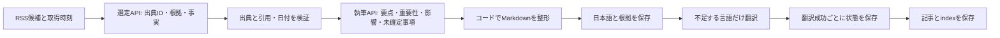

# 記事構成と生成・再開の使い方

## 記事の構成

日本語の新規記事は、次の順序で生成します。

1. 公開日（JST）と情報の範囲
2. **今日の要点**：2〜3項目が目安。ニュースが少ない日は1項目から
3. **主要ニュース1〜5件**：分類、出典で報告されている事実、なぜ重要か、影響を受ける人・分野、推測される影響、未確定事項、出来事の日付、出典
4. **今日の見取り図**：ニュース間の共通点・相違点、または少数ニュースの意義
5. **参考リンク**：一次／二次／種別未確認の区分、資料の公開日時、取得時刻

[架空データによる完成見本](examples/editorial-preview.md)を参照してください。既存の公開記事をこの構成へ一括変換する処理は行っていません。

## 生成の仕組み



選定APIは、各事実を候補内の出典IDと原文の短い引用に結び付けます。存在しないID、原文にない引用、同じ出典の重複選定は拒否します。出来事の日付は年・月・日を資料で照合できる場合だけ採用し、それ以外は不明として扱います。RSS記事の公開日時を出来事の日付へ流用しません。

執筆APIには選定済みの情報だけを渡します。見出し、リンク、日付表示はアプリが組み立て、モデルから返された文章はエスケープします。事実の箇条書きは選定段階の内容を使用するため、執筆段階での書き換えを防げます。

翻訳は1言語1回で行い、出典URL、見出し数、数値表記の絶対日付・時刻を保持しているか検証します。翻訳時も、確定事項・編集上の解釈・推測・不明点の区別を維持するよう指示します。

通常のAPI呼び出しは**選定1回＋執筆1回＋翻訳4回＝6回**です。該当するAIニュースが0件なら選定後に終了し、記事を作りません。各段階のHTTPエラー、未完了出力、形式不備は共通の最大3回の枠内で再試行します。

## 実行

```sh
npm run generate
```

日本語の記事が完成すると、コンソールに次の形式の保存先が表示されます。

```text
output/generation/2026-09-28-<generationId>.json
```

ここには日本語の記事、出典・根拠、選定・執筆の構造化データ、成功した翻訳、公開に使ったslugを保存します。APIキーは保存しません。`output/`はGitの追跡対象外です。

ファイルを保存せずに生成と翻訳を確認する場合:

```sh
npm run test:dry
```

このコマンドは実APIを利用します。翻訳が残った場合は終了コード1になり、記事・チェックポイントは書きません。

## 失敗した翻訳を再開する

実際に表示されたJSONファイルのパスを指定します。

```sh
npm run generate -- --resume "output/generation/2026-09-28-<generationId>.json"
```

- RSS取得と日本語の選定・執筆を省略し、不足する言語だけを翻訳します。
- 日本語と成功した翻訳は、未完了の言語があっても公開用ファイルへ保存します。未完了の言語は既存の日本語フォールバックで表示されます。
- 再開時には同じ記事の不足翻訳を追加し、記事を重複登録しません。API不要な完成済みチェックポイントならキー未設定でも再開できます。
- 公開日をチェックポイントに固定するため、翌日の再開でも本文とメタデータの日付がずれません。
- 保存済み記事の本文や日本語メタデータに手編集がある場合、上書きせず停止します。
- 同じチェックポイントの処理をローカルで同時に実行しないでください。

再開内容を保存前に確認する場合:

```sh
npm run generate -- --resume "output/generation/2026-09-28-<generationId>.json" --dry-run
```

`--dry-run`を付けると、元のチェックポイントも更新しません。

## GitHub Actionsでの再開

ワークフローは保存済みJSONを`generation-checkpoint-<run_id>-<attempt>`というArtifactへ保存します。保存期間は14日です。失敗した実行でも、チェックポイントが作られていれば回収できます。日本語生成前に停止した場合はまだファイルがないため、Artifactは作られません。

Actionsの実行画面からArtifactをダウンロード・展開し、最新のリポジトリで上記`--resume`を実行します。pushに失敗した実行の保存データも、slugが他の記事と衝突しなければ復元できます。別の記事が同じslugを使っている場合は停止します。公開用ファイルの反映には、通常通り変更の確認とGitへのcommit/pushが必要です。

生成スクリプトの上限は24分、Actionsジョブの上限は28分です。選定・執筆・翻訳の再試行と、保存・push・Artifact回収の余裕を分けています。

## 検証の限界と次の確認

引用の一致は、要約された主張が論理的に正しいことや資料そのものの正しさを保証しません。一次情報も発信元の主張であり、独立した検証済み事実とは限りません。RSSの抜粋は最大1,500文字で、原文全体を取得する機能はありません。英語の日付など対応していない表記は、誤った日付に変換する代わりに不明とします。

2026年9月28日、API残高追加後に`npm run test:dry`を実行し、20候補から5ニュースの選定、日本語記事の執筆、英語・繁体字中国語・簡体字中国語・韓国語への翻訳、終了コード0を確認しました。記事の保存・公開はしていません。

この実行で中国語翻訳のリンク括弧が欠けるケースを検出したため、同じURLへの繰り返し引用も含め、リンクの数と形式を検証するよう修正しました。修正後の実API確認では、リンク構文の不一致を2件検出して再試行し、全言語が検証を通過しました。また、RSS取得失敗後に通信が残ってコマンドが終了しない問題を修正し、HTTPエラー時の応答キャンセルとタイムアウト時の通信中断をテストしています。回帰テストは49件通過しています。

RSS取得ではVentureBeatのHTTP 429とAnthropicのHTTP 403が継続していますが、他の取得元から生成を完了しています。これはOpenAI APIの残高不足とは別の問題です。機械検証は翻訳の自然さや事実性まで保証しないため、公開前の内容確認は引き続き必要です。
